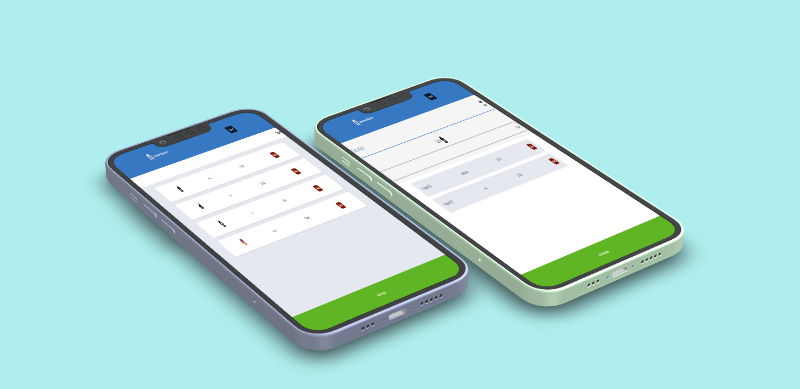

 

# 📗 Index

- [📖 About the Project](#about-project)
  - [🛠 Built With](#built-with)
    - [Key Features](#key-features)
  - [🚀 Live Demo](#live-demo)
- [💻 Getting Started](#getting-started)
  - [Setup](#setup)
  - [Prerequisites](#prerequisites)
  - [Testing](#testing)
  - [Usage](#usage)
  - [Deployment](#deployment)
- [👥 Authors](#author)
- [🔭 Future Features](#features)
- [🤝 Contributing](#contributing)
- [⭐️ Show your support](#support)
- [🙏 Acknowledgements](#acknowledgements)
- [📝 License](#license)

# 📖 Cost Cut App 

The Ruby on Rails Cost Cut App application exemplifies the MVC architecture and leverages the Devise gem for authentication and the CanCanCan gem for authorization. Demonstrating the robust capabilities of Ruby on Rails, this app seamlessly interacts with a database to deliver an impressive user experience.

This system provides users with enhanced capabilities for managing their budgets. Users are empowered to efficiently handle their finances through various features:

1. **Category Selection and Naming:** Users can select specific group categories and create custom names for them.

2. **Expense Summary:** The main dashboard prominently displays the cumulative expenses for each category. This information is derived from the transactions entered through the transaction form.

3. **Transaction Details:** The second view presents an itemized list of transactions associated with a chosen category. Users can input expense amounts for each transaction.

4. **Category Transaction Total:** This section also showcases the total amount spent within the selected category, giving users a clear overview of their spending.

In essence, this system diligently tracks and records the expenses generated by the user, thereby facilitating effective budget management.

## 🛠 Built With 

### Tech Stack 

    
Client

    <ul>
      <li><a href="https://www.ruby-lang.org/en/">Ruby</a></li>
      <li><a href="https://rubyonrails.org/">Ruby on Rails</a></li>
    </ul>
  

Database

  <ul>
   <li><a href="https://www.postgresql.org/">PostgreSQL</a></li>
  </ul>

### Key Features 

- *[MVC Pattern]* Follows the MVC(Model, View, Controller) pattern which allows it to be easy to manage
- *[Authentication]* Counts with an authentication system using [Devise Gem](https://github.com/heartcombo/devise) which allows the user to have an unique account with its own email and password, and also allows the user to edit its own profile
- *[Migration of Database using Rails method]* All the data storaged is actually being managed by a Database, and the migration of the database is being done using the rails method
- *[Testing]* All the views are being tested using [RSpec](https://rspec.info/) and [Capybara](https://github.com/teamcapybara/capybara)
- *[Linters]* It follows the rules of 2 very well knowed linters [Rubocop](https://rubocop.org/) & [Stylelint](https://stylelint.io/), which helps to keep the code clean and easy to read
- *[Gitflow]* Used [Gitflow](https://www.atlassian.com/git/tutorials/comparing-workflows/gitflow-workflow) as a workflow which allows to have a clean and organized version control

(<a href="#readme-top">back to top</a>)

## 🚀 Preview 

https://www.loom.com/share/26ca94c5ef1646d1ab5894661fea6f28?sid=4347225b-c4e1-4204-880d-cca374695b31

(<a href="#readme-top">back to top</a>)

## 💻 Getting Started 

To get a local copy up and running, follow these steps.

### Prerequisites

In order to run this project you need:

sh
 To have ruby installed with the last version of rails

### Setup

Clone this repository to your desired folder:

sh
  Run bundle install to install all the gems and dependencies

### Usage

To run the project, execute the following command:

sh
  Executing the command 'rails s' will start the server of this RoR app

### Testing

To run integration tests, you have to follow these steps:

sh
  Executing the command `bundle install` will install all the necessary dependencies to run the tests of this RoR app

sh
  To run all the tests, execute the command 'rspec'

sh
  To run tests by using rspec

### Deployment

https://rails-emv5.onrender.com

(<a href="#readme-top">back to top</a>)

## 👥 Authors 

👤 Daniela Moreno

- GitHub: [@Danielamoreno699](hhttps://github.com/danielamoreno699)
- LinkedIn: [Daniela Moreno](https://www.linkedin.com/in/daniela-moreno-06a139124/)

## 🔭 Future Features 

- *[Responsive Design]* Build a fully responsive design
- *[User Profile]* Add a user profile page

(<a href="#readme-top">back to top</a>)

## 🤝 Contributing 

Contributions, issues, and feature requests are welcome!

Feel free to check the [issues page](../../issues/).

(<a href="#readme-top">back to top</a>)

## ⭐️ Show your support 

If you like this project, be pending on our profiles. We are open to listen your opinion!

(<a href="#readme-top">back to top</a>)

## 🙏 Acknowledgments 

We extend our heartfelt gratitude to the Microverse Team and our valued partners, whose collaboration and support have been instrumental in bringing this project to fruition.

(<a href="#readme-top">back to top</a>)

## 📝 License 

This project is [MIT](./LICENSE.md) licensed.

(<a href="#readme-top">back to top</a>)
